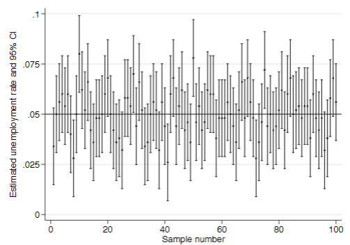
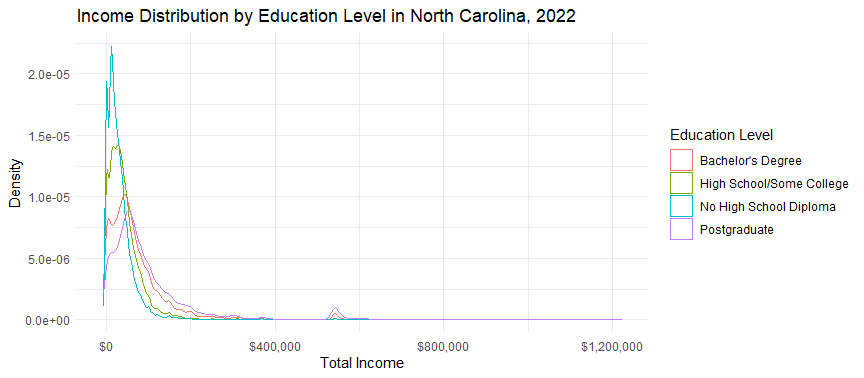
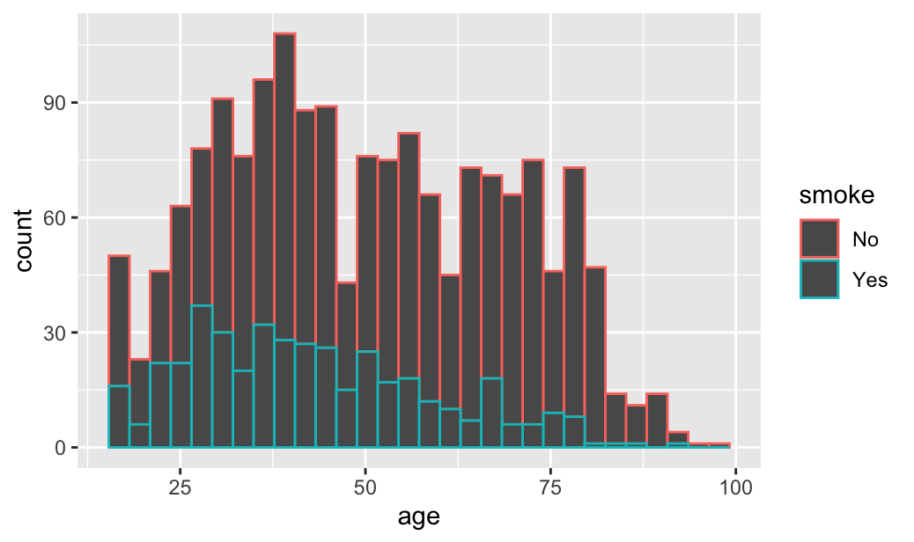

# North Carolina ACS Data Analysis 2022

Welcome to the repository for data analysis on the American Community Survey (ACS) 2022 focusing on the state of North Carolina. This project examines a wide array of demographic and economic data concerning individuals aged 25 and older. With 75,340 observations, our analysis aims to uncover patterns related to education and income across different cities in North Carolina.

## Data Source

The primary dataset, `acsnc2022.Rdata`, encapsulates survey results from the 2022 American Community Survey (ACS) concerning North Carolina residents aged 25 and above. The dataset is comprehensive and provides a fertile ground for in-depth demographic and economic analysis.

## Scripts Overview

This repository includes three R scripts designed to perform analyses at varying levels of complexity:

### 1. `BasicAnalysis.R`

This script introduces the dataset and performs preliminary data manipulation and exploration. Key operations include:
- Loading the `acsnc2022.Rdata` dataset.
- Creating a binary indicator for college education.
- Basic summary statistics to understand the dataset's composition.

The output will be visible in the R console, providing an initial overview of the data's structure and content.

### 2. `IntermediateAnalysis.R`

Building on the basic analysis, this script delves deeper into the dataset by:
- Grouping data by metropolitan area (`met2023`).
- Calculating mean and standard deviation of total income (`inctot`) within each group.
- Determining the share of individuals with college education (`college`) in each city.
- Generating insights on income and educational disparities across different urban areas.

The output will be visible in the R console, providing a more detailed analysis of income and education patterns in North Carolina cities.

### 3. `HypothesisAndConfidenceLevel.R`

This advanced script focuses on statistical analysis, including hypothesis testing and confidence interval estimation, to derive significant insights from the data. It aims to answer specific research questions about demographic and economic indicators in North Carolina, utilizing the `tidyverse` for data manipulation and `ggplot2` for visualization.

The script covers the following analyses:
- Testing the hypothesis that the mean income of individuals with college education is higher than those without.
- Calculating the 95% confidence interval for the difference in mean income between the two groups.
- Visualizing the distribution of income by education level.
- Conducting a hypothesis test on the difference in mean income between individuals with and without college education.

The output will be in the R console, including statistical test results, confidence interval estimates, and visualizations to support the analysis.

### 4. `UnemploymentRateCISimulation.do`

This particular script is used for simulating sampling from a population with a 5 percent unemployment rate, calculating the mean unemployment rate for each sample, and then computing the 95% confidence interval (CI) for these means.

Here is the output of this file, if you're interested:  

<p align="center">
  
</p>

### 5. `AdvancedDataVisualization.R`

This R script performs advanced data analysis and visualization on the 2022 American Community Survey (ACS) data for North Carolina, focusing on individuals aged 25 and older. We will explore relationships between education, income, and metropolitan areas through various visualizations.

Here is the output of this file, if you're interested:

<p align="center">
  
</p>

### 6. `smoking_analysis.R`

This R script performs data analysis and visualization on the 2022 American Community Survey (ACS) data for North Carolina, focusing on individuals aged 25 and older. We will explore the relationship between smoking status and income level through various visualizations.

It has multiple plots and walks you through the analysis step by step.

Here is one of the outputs of this file, if you're interested:

<p align="center">
  
</p>

*NOTE: Feel free to add more Data Analysis and Visualization scripts as you wish!*

### 6. `Additional_R_Scripts`

There is also a `Additional_R_Scripts` subdirectory for more R scripts. Feel free to run them to gain more insights about the ACS data!

## Getting Started

To get started with this repository, you'll need R installed on your machine along with the following R packages:
- `tidyverse`: For data manipulation and visualization.
- Optionally, other packages for advanced statistical analysis as explored in `HypothesisAndConfidenceLevel.R`.

You can install `tidyverse` using the following command in R:
```R
install.packages("tidyverse")
```

- Next, install the `ggplot2` package for advanced data visualization:
```R
install.packages("ggplot2")
```

- Also install the `dplyr` package for data manipulation:
```R
install.packages("dplyr")
```

Remember to do the same for installing other packages, if you haven't already.

## Usage

Each script is designed to be run independently, depending on the level of analysis you are interested in:
1. For a quick overview and initial insights, run `BasicAnalysis.R`.
2. For a more detailed exploration by city, including income and education analysis, proceed with `IntermediateAnalysis.R`.
3. To explore specific hypotheses about the dataset with statistical rigor, `HypothesisAndConfidenceLevel.R` is your go-to script.

Make sure to set your working directory to the repository's root or adjust the path to the `acsnc2022.Rdata` file accordingly before running the scripts.

## Contributing

Contributions to this analysis are welcome. Please feel free to fork the repository, make changes, and submit pull requests. For major changes, please open an issue first to discuss what you would like to change.

## License

This project is open source and available under the [MIT License](LICENSE).

## Contact

For any queries or further discussions, please open an issue in the repository, and we will get back to you as soon as possible.

---

Created with ❤️ by [Son Nguyen](https://github.com/hoangsonww) in 2024. Thank you for visiting! 🚀
